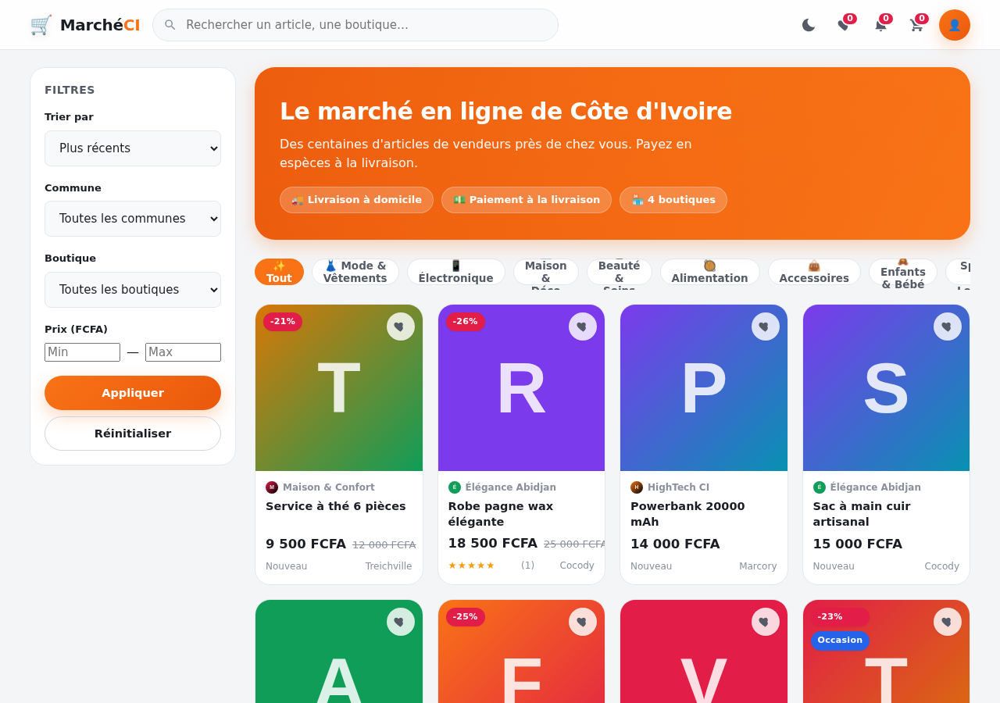
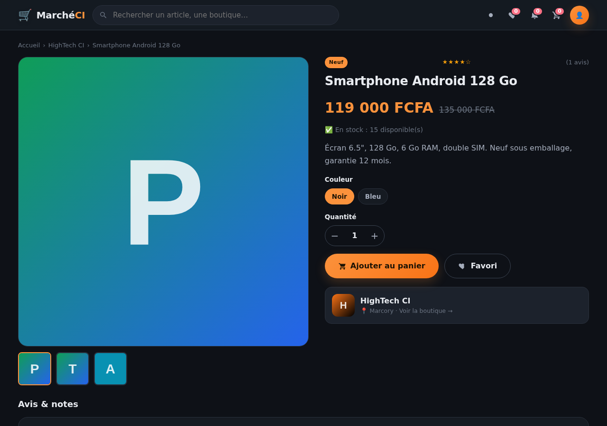
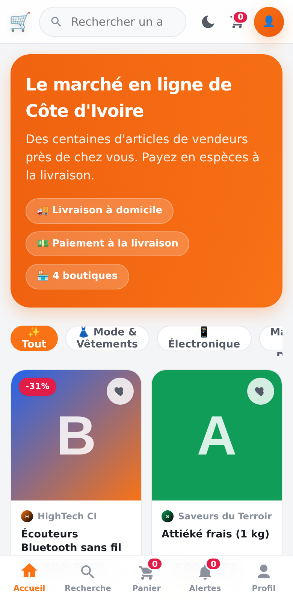

# 🛒 Marché CI — Marketplace multi-vendeurs (front-end)

Marketplace multi-vendeurs **100 % front-end** (HTML / CSS / JavaScript vanilla), pensée pour le marché **ivoirien / ouest-africain francophone**. Aucune dépendance externe, aucun back-end, aucune étape de build : **il suffit d'ouvrir `index.html`**.

Toutes les données (comptes, boutiques, articles, commandes, abonnements, notifications, panier, avis) sont persistées **côté navigateur via `localStorage`**. Les images sont stockées en **base64** (redimensionnées automatiquement).

---

## 🚀 Démarrage

1. Ouvrir le fichier **`index.html`** dans un navigateur moderne (Chrome, Firefox, Edge, Safari).
2. C'est tout. Les données de démonstration sont injectées automatiquement au premier lancement.

> Astuce : pour repartir de zéro, connectez-vous en **admin** et cliquez sur « Réinitialiser les données démo » (ou videz le `localStorage` du site).

---

## 🖼️ Aperçu

| Bureau (clair) | Fiche article (sombre) | Mobile (app-like) |
|---|---|---|
|  |  |  |

---

## 🔑 Comptes de test

| Rôle | E-mail | Mot de passe |
|------|--------|--------------|
| **Client / Acheteur** | `client@test.ci` | `1234` |
| **Vendeur** (boutique « Élégance Abidjan ») | `elegance@test.ci` | `1234` |
| **Vendeur** (boutique « HighTech CI ») | `hightech@test.ci` | `1234` |
| **Vendeur** (boutique « Saveurs du Terroir ») | `saveurs@test.ci` | `1234` |
| **Vendeur** (boutique « Maison & Confort ») | `maison@test.ci` | `1234` |
| **Admin** | `admin@test.ci` | `1234` |

Données de démo : **4 boutiques**, **16 articles**, quelques avis, abonnements et notifications.

---

## ✨ Fonctionnalités

### Visiteur / Acheteur
- Fil d'accueil regroupant les articles de **toutes les boutiques**.
- Recherche + filtres (catégorie, commune, boutique, prix, tri).
- Fiche article détaillée, **rattachée à sa boutique d'origine** (variantes taille/couleur, galerie).
- **Panier multi-boutiques** : au checkout, les articles sont **regroupés par boutique** → **une commande par boutique**.
- **Paiement à la livraison** uniquement (espèces) : saisie des coordonnées (nom, téléphone, commune, adresse/point de repère) + numéro de commande généré.
- Favoris (wishlist), historique des commandes, profil éditable.
- **Abonnement aux vendeurs** → notification à chaque nouvel article publié.
- Système d'**avis / notes en étoiles** sur les articles et les boutiques.

#### 💡 Innovations de l'espace client
- **Recherche intelligente** : autocomplétion, suggestions, historique, recherches populaires, et **recherche vocale** (Web Speech API).
- **Filtres avancés & tri** : promo, livraison offerte, en stock, état, note minimale ; tri par nouveauté/popularité/**note**/**meilleures promos**/prix.
- **Page « Bons plans »** : promotions + **ventes flash** avec comptes à rebours.
- **« Vus récemment » + recommandations personnalisées**, **onglet « Suivis »**, **onboarding** (catégories préférées → fil sur mesure).
- **Comparateur d'articles** (jusqu'à 4, barre flottante).
- **Alerte prix** et **alerte réassort** (notifications automatiques).
- **Partage d'article** (WhatsApp + affiche), **estimation des frais de livraison** sur la fiche selon la commune.
- **Réachat rapide** et **notation de la livraison** après réception.
- **Avis enrichis** : badge **« achat vérifié »**, **photo**, vote « utile », tri par pertinence.
- **Carnet d'adresses** + **avatar de profil**, sélection rapide au checkout.
- **Programme de fidélité** (points, paliers Bronze/Argent/Or) + **parrainage**.
- **Centre d'aide / FAQ**, **signalement** d'article, **préférences de notifications**, **taille du texte** (accessibilité).

##### 🆕 Nouveau lot d'innovations client
- **Annuaire des boutiques** (`#/stores`) : toutes les boutiques classées par **réputation** (note, ventes, nombre d'articles), badge **vendeur fiable**, filtre par commune.
- **Page « Mon activité »** (`#/activity`) : vus récemment, recherches récentes, **alertes prix/réassort** et **alertes de recherche** gérables au même endroit.
- **Questions & réponses publiques** sur chaque fiche article (le vendeur répond publiquement).
- **Faire une offre / négociation** : sur les articles marqués « prix négociable », le client propose son prix (transmis via la messagerie).
- **Souvent achetés ensemble** (co-occurrence dans les commandes) sur la fiche article.
- **Historique de prix** avec **mini-graphe (sparkline)** et repère « prix le plus bas ».
- **Alertes de recherche enregistrées** : notification dès qu'un nouvel article correspond aux critères.
- **Tri « près de chez moi »** (articles des boutiques de ma commune en premier).
- **Signalement de problème sur une commande** (colis non reçu, article endommagé…) → vendeur + admin notifiés.
- **Partage enrichi** : copie du lien, partage natif du navigateur (Web Share) en plus de WhatsApp/affiche.
- **Rappel de panier abandonné** (notification après un délai si le panier n'est pas vide).
- **Multi-langue Français / English** (sélecteur dans le profil, chrome traduit).
- **Contraste élevé** (accessibilité) et **assistant virtuel** flottant (chatbot d'aide à réponses guidées).

##### ✅ Finalisation de l'espace client
- **Gestion du compte** : **changer son mot de passe**, **exporter ses données** (fichier JSON, portabilité), **supprimer son compte** (avec anonymisation des commandes conservées côté vendeur).
- **Commande en tant qu'invité** (sans compte) : les commandes sont rattachées à l'appareil, puis **récupérées automatiquement** à la création d'un compte ou à la connexion.
- **Retours / échanges** : demande depuis une commande livrée (type, motif, description) → le **vendeur accepte ou refuse** (avec message), suivi du statut côté client.
- **Gestion de ses avis** : **modifier** / **supprimer** son propre avis, et **signaler** un avis abusif (transmis à la modération).
- **Livraison estimée** : fenêtre de dates affichée sur la commande + **rappel de suivi** pour les commandes expédiées.

##### 🧩 Confort & finitions (parcours client)
- **Page catégorie dédiée** (`#/category/:id`) avec **fil d'Ariane**, en-tête catégorie et sous-filtres (tri, en promo, en stock).
- **Panier « garder pour plus tard »** : mise de côté d'un article + **alertes de ligne** (rupture, baisse de prix depuis l'ajout).
- **Centre de notifications enrichi** : filtres par type (commandes, nouveautés, messages…), **regroupement par date**, suppression unitaire, tout marquer comme lu.
- **Recherche « aucun résultat » intelligente** : **correction de fautes** (« Vouliez-vous dire… »), catégorie proche, catégories populaires et articles alternatifs.
- **Multi-langue plus complet** : vues principales traduites (accueil, panier, commandes, profil, menu) — bascule Français / English en direct.
- **Accessibilité** : lien « aller au contenu », **focus clavier visible**, cartes produit navigables au clavier, focus géré dans les modales, `aria-label` sur les actions.
- **Bandeau confidentialité** (stockage 100 % local) + **tour de bienvenue** à la première visite.
- **Installation PWA** : bouton « Installer l'application » (via `beforeinstallprompt`).
- **Listes de souhaits multiples** : plusieurs listes nommées, ajout d'un article à une ou plusieurs listes, **renommage / suppression / partage** (WhatsApp, copie).

### Vendeur — espace dédié (back-office)
L'espace vendeur est un **véritable back-office distinct de l'espace client** : barre latérale sombre de navigation, en-tête « Espace Vendeur » (le chrome d'achat — recherche, panier, favoris, nav basse mobile — est masqué), et zone de travail professionnelle.

- Inscription vendeur / activation « Ouvrir ma boutique » depuis un compte client, avec **écran d'accueil (onboarding)**.
- **Création de boutique** : nom, logo, bannière, description, catégorie, commune, horaires, WhatsApp, réseaux sociaux.
- **Tableau de bord** : chiffre d'affaires simulé, articles publiés, commandes reçues, abonnés, articles les plus vus + dernières commandes.
- **Gestion des articles** : liste filtrable par statut (Tous / Publiés / Brouillons / Dépubliés) + recherche, avec pour chaque article : **voir la page publique**, éditer, **publier / dépublier**, supprimer.
- **CRUD articles** : titre, description, prix FCFA, prix promo, stock, catégorie, **plusieurs images**, état (neuf/occasion), variantes (taille/couleur), statut (publié/brouillon/dépublié).
- **Gestion des commandes reçues** (filtrables par statut) : changement de statut (en attente → confirmée → expédiée → livrée / annulée) → notifie l'acheteur.
- Accès direct à la **page publique de la boutique (vitrine)** et aux **pages articles** depuis le back-office.
- Réponse aux avis clients → notifie l'auteur.
- **Menu vendeur en bas d'écran (mobile)** propre à l'espace vendeur, distinct de la nav client : Tableau, Articles, bouton central « + », Commandes, et une feuille « Menu » (vitrine, profil, accueil, notifications…).

#### 💡 Innovations de l'espace vendeur

**Pilotage & statistiques**
- **Tableau de bord analytique** (SVG/CSS pur, sans librairie) : ventes des 7 derniers jours, répartition des commandes par statut (donut).
- **Page Statistiques dédiée** : CA / commandes / panier moyen / taux de livraison par période (7j, 30j, mois) avec **comparaison à la période précédente**, **top articles**, **top communes clientes**, **encaissement COD** (déjà encaissé / reste à encaisser) et **entonnoir de conversion** (vues → panier → ventes).
- **Objectif de vente mensuel** avec barre de progression.
- **Score de complétude** de la boutique + **checklist d'onboarding**.
- **Alertes de stock** : rupture et stock faible détectés automatiquement (+ notification à chaque commande).

**Catalogue**
- **Actions groupées** (publier / dépublier / supprimer plusieurs articles).
- **Édition rapide du stock** en ligne (sans ouvrir le formulaire).
- **Article « à la une »** (mis en avant en tête de vitrine).
- **Promotions datées** (prix promo avec date de fin, expiration automatique).
- **Duplication rapide** d'un article ; **import/export du catalogue** (JSON).

**Commandes & livraison (COD)**
- **Frais de livraison fixés par le vendeur** : un montant par défaut saisi dans « Ma boutique », **ajustable commande par commande** (le total est recalculé et le client notifié).
- **Suivi de livraison visuel** (barre d'étapes) côté acheteur et vendeur.
- **Suivi d'encaissement** (payé / à encaisser) ; livrée = encaissée.
- **Bon de livraison imprimable** (+ impression groupée des commandes confirmées).
- **Filtres commandes** par statut, période et recherche (n°/client) ; **export CSV** (Excel).

**Rentabilité & trésorerie**
- **Coût d'achat par article** → **marge** unitaire et **bénéfice net** (marge − dépenses) sur les statistiques.
- **Journal de caisse** : saisie des dépenses/charges par catégorie → mini compte de résultat.
- **Rapport de statistiques imprimable** enrichi (marge brute, bénéfice net).

**Ventes & confiance**
- **Ventes flash** : promo à durée limitée avec **compte à rebours en direct** (badge ⚡ + minuteur).
- **Alertes baisse de prix** : les clients ayant mis l'article en **favori** sont notifiés au lancement d'une promo.
- **Articles similaires (cross-sell)** en bas de fiche produit.
- **Facture / reçu imprimable** (PDF) par commande (acheteur & vendeur).
- **Badge de fiabilité vendeur** sur la vitrine (taux de livraison, délai de traitement moyen).
- **FAQ de boutique** et **politique de retour** affichées sur la vitrine.
- **Historique des modifications** d'un article (prix, stock, statut, promo).

**Relation client**
- **Segments clients** (nouveau / fidèle / inactif) + **relance « win-back »** WhatsApp pré-remplie des clients inactifs.
- **Réponses rapides (modèles)** dans la messagerie vendeur.

**Promotions & fidélisation**
- **Codes promo / coupons** créés par le vendeur (remise en %, en FCFA, ou livraison offerte ; achat minimum, limite d'usage, date d'expiration) et saisis par l'acheteur au paiement.
- **Livraison offerte dès un montant** paramétrable par le vendeur.
- **Générateur d'affiche produit** (image via canvas) à télécharger et partager sur WhatsApp/statut, Facebook, Instagram.

**Messagerie & commandes**
- **Messagerie in-app acheteur ↔ vendeur** (« Poser une question au vendeur » depuis une fiche article) avec badges de non-lus.
- **Créneau de livraison** souhaité choisi au paiement.
- **Annulation avec motif** (par l'acheteur ou le vendeur) + restauration automatique du stock.
- **Pré-commande / date de réapprovisionnement** affichée en cas de rupture.

**Pilotage avancé**
- **Conseils vendeur (coaching)** contextuels + rappel des commandes en attente depuis +24 h.
- **Comparaison à la moyenne de la marketplace** (taux de livraison, volume).
- **Insights favoris** (articles les plus ajoutés en favoris = demande latente).
- **Rapport de statistiques imprimable** (PDF via impression).

**Application installable (PWA)**
- **Manifest + service worker** : l'app est **installable** (« Ajouter à l'écran d'accueil ») et fonctionne **hors ligne** lorsqu'elle est servie en http/https (dégradation propre en ouverture `file://`).

**Vitrine personnalisée**
- **Photo de profil (logo)** et **bannière de couverture** uploadables.
- **Galerie photos** de la boutique (ambiance, coulisses…) avec **visionneuse plein écran** (lightbox, navigation clavier/flèches).
- **Slogan / accroche** affiché sous le nom.
- **Couleur personnalisée** de la boutique (accent appliqué à la vitrine).
- **Réseaux sociaux cliquables** (Instagram, Facebook, TikTok) : le vendeur saisit un pseudo ou un lien, et des boutons ouvrent directement l'app/la plateforme (nouvel onglet ; ouverture native sur mobile).

**Boutique & marketing**
- **Mode ouvert / fermé (vacances)** : suspend les commandes + bandeau sur la vitrine.
- **Bandeau promotionnel** de la vitrine.
- **Partage WhatsApp** d'un article ou de la boutique (texte pré-rempli).
- **QR code de la boutique** (généré 100 % hors-ligne) imprimable.
- **Mini-CRM clients** : historique, total dépensé, badge « fidèle », contact WhatsApp.
- **Sauvegarde / restauration** complète des données (JSON).

### Admin
- Console de modération : statistiques globales, suppression de boutiques/articles, réinitialisation des données de démo.

### Notifications (client-side)
- Cloche avec badge de non-lus.
- Déclencheurs : nouvel article d'un vendeur suivi, changement de statut de commande, réponse à un avis.
- Persistance `localStorage`, marquage lu/non-lu, effacement.

---

## 🎨 Design & UX
- Design moderne : palette orange/vert, coins arrondis, ombres douces, micro-animations.
- **Responsive multiplateforme** :
  - **Mobile** : barre de navigation basse type application (Accueil, Recherche, Panier, Alertes, Profil), transitions entre écrans, feuilles modales.
  - **Desktop** : header sticky + sidebar de filtres + grille large.
- **Mode clair / sombre** avec bascule persistée (suit la préférence système par défaut).
- États de chargement (skeletons), états vides illustrés, toasts de confirmation.

---

## 🗂️ Structure

```
marketplace/
├── index.html
├── css/
│   ├── theme.css        # variables, palette, thème clair/sombre
│   ├── style.css        # composants & layout desktop
│   └── responsive.css   # tablette & mobile (app-like)
├── js/
│   ├── db.js            # abstraction localStorage (namespace MP.DB)
│   ├── i18n.js          # multi-langue (français / english)
│   ├── ui.js            # formatage, échappement XSS, toasts, modales, upload base64
│   ├── notifications.js # notifications client-side
│   ├── auth.js          # inscription, connexion, session, rôles
│   ├── store.js         # boutiques, abonnements, avis boutique
│   ├── products.js      # CRUD articles, vues, avis, recherche/filtres, historique prix
│   ├── coupons.js       # codes promo (boutique + bons globaux fidélité/bienvenue)
│   ├── client.js        # vus récemment, alertes, comparateur, fidélité, Q&A, alertes de recherche
│   ├── cart.js          # panier multi-boutiques
│   ├── orders.js        # commandes (paiement à la livraison)
│   ├── seed.js          # données de démonstration
│   ├── router.js        # routeur SPA (hash routing)
│   └── app.js           # point d'entrée + rendu des vues + wiring
└── assets/
    └── placeholder.svg
```

Architecture : chaque module s'attache au **namespace global `window.MP`** (scripts classiques, compatibles avec l'ouverture directe en `file://` — pas de modules ES pour éviter les restrictions CORS locales).

---

## 🔒 Sécurité (front basique)
- **Échappement anti-XSS** systématique du contenu utilisateur à l'affichage (`MP.UI.esc`).
- Validation des formulaires, dont le **numéro de téléphone de livraison** (format ivoirien).
- Nettoyage des sources d'images (`data:` / `http(s):` uniquement).

---

## ⚠️ Limites (assumées — projet démo front-only)
- **Données locales au navigateur** : rien n'est synchronisé entre appareils ; vider le cache/`localStorage` efface tout.
- **Mots de passe stockés en clair** dans `localStorage` (démo uniquement — jamais en production).
- Le `localStorage` a une capacité limitée (~5 Mo) : chaque image est fortement **compressée sous un budget** (logo ~45 Ko, galerie ~85 Ko, article ~120 Ko, bannière ~150 Ko) — une galerie de 8 photos ≈ 700 Ko. En cas de quota réellement dépassé, l'enregistrement échoue explicitement (message clair) au lieu de faire croire à une sauvegarde.
- Chiffre d'affaires et statistiques sont **simulés** localement.
- Aucun paiement en ligne : **paiement à la livraison** exclusivement, conforme au contexte.
